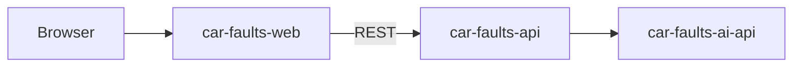

# Car Faults Web

Frontend for **Car Faults** — a SaaS focused on **chronic reliability by vehicle model**: what typically fails on a given make / model / year / engine, how severe it is, typical cost and how it gets fixed.

Initial market: **Portugal** (later ES/FR). Product languages: `pt-PT` (default), `en-GB` and `es-ES`.

## What we are

The Next.js frontend that consumes [`car-faults-api`](../car-faults-api) (Nest backend) and renders known-issue lookups, reviews, and fixes for buyers and owners.

## What we are not

We do **not** call the AI service directly, provide VIN history, odometer fraud checks, or accident records for a specific vehicle (that problem space belongs to services like carVertical / Certidão / IPO). All AI-generated content is fetched through the Nest API, never from [`car-faults-ai-api`](../car-faults-ai-api).

## Problem we solve

Known-issue information is fragmented across forums, YouTube, ADAC/TÜV reports, and Facebook groups. Buyers and used-car owners often discover chronic faults too late. This app gives them one place to look up a model before they buy.

## Stack

| Layer | Technology |
|-------|------------|
| Framework | Next.js 16 (App Router) + React 19 |
| Styling | Tailwind CSS + shadcn/ui |
| i18n | [next-intl](https://next-intl.dev) (`pt-PT` / `en-GB` / `es-ES`, locale-prefixed routes) |
| Tests | Jest + React Testing Library |
| Backend | [car-faults-api](../car-faults-api) (Nest) — never calls AI directly |

No Supabase, Prisma, or Mapbox — those were leftovers from the original template and have been removed.

## Project structure

```
app/
  layout.tsx                 # <html>/<body>, fonts, locale read via next-intl
  [locale]/
    layout.tsx                # NextIntlClientProvider, SiteHeader, SiteFooter
    page.tsx                  # Landing: hero, search, stats, top faults
    recalls/ | compare/ | about/  # Stub pages ("coming soon")
    defects/page.tsx          # pSEO hub (filterable via searchParams)
    defects/[make]/[model]/[year]/page.tsx  # pSEO vehicle profile
    not-found.tsx
  sitemap.ts
  robots.ts
components/
  ui/          # shadcn primitives (unmodified API)
  layout/      # site-header, site-footer, site-shell, locale-switcher, mobile-nav
  home/        # hero-section, vehicle-search-form, stats-bar, top-faults-section
  faults/      # fault-card, fault-card-grid
  brand/       # logo
i18n/          # next-intl routing, navigation and request config
messages/      # pt-PT/, en-GB/, es-ES/ — one JSON file per namespace
lib/mocks/     # fixture vehicles + top faults (no backend integration yet)
types/vehicle.ts
```

Vehicle/fault data currently comes from local fixtures in `lib/mocks/` — wiring this page to `car-faults-api` is a follow-up.

## MVP / What this app does

1. Lookup by make, model, year, and engine (delegated to `car-faults-api`)
2. Display `known_issues` + `tech_specs` for a vehicle
3. Google login (via the API)
4. Reviews and comments on issues
5. Fixes (AI-generated and/or user-submitted)
6. Vehicle photo uploads

AI content is marked as generated, and product copy should treat results as indicative — not a substitute for a mechanic.

## How it fits



This app never talks to `car-faults-ai-api` directly — all AI-derived content flows through the Nest API.

## Getting started

```bash
npm install
npx skills check
npx skills update
```

Agent skills are defined in `skills-lock.json` and installed into `.agents/` (gitignored). Run `npx skills update` after pulling changes that modify the lock file.

```bash
npm run dev
```

### Useful URLs

| Resource | URL |
|----------|-----|
| App | `http://localhost:3000` |

### Development workflow

Before committing or opening a pull request, always run:

```bash
npm run lint   # check code style and ESLint rules
npm run test   # run unit tests
npm run build  # verify the production build
```

## Tests

```bash
npm run test      # unit tests
npm run test:cov  # with coverage report and 90% gate
```

Global coverage (statements, branches, functions, lines) must stay at **90%+**. PRs and pushes to `main` run `npm run test:cov` in CI and fail below that threshold.

## License

Proprietary — All Rights Reserved (Daniel Fonseca da Silva). See [LICENSE](LICENSE).
Use and run allowed; modification and derivative works require written permission.

You may use and run this software. You may **not** modify it or create derivative works without prior written permission from the copyright holder.
